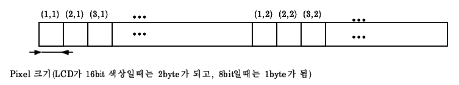

# 4.14. Frame Buffer

LCD 화면에 프레임 버퍼의 내용을 출력하거나, 화면의 정보를 얻어오는 함수로 구성되어 있다.

LCD 에 화면 내용을 변경하는 것을 시간을 요하는 작업이므로, Double Buffering 개념을 이용하여 화면 출력 시간을 최소화 한다. `MG_fbGetScreenBuffer()` 를 사용하면, 시스템에서 사용하는 이미지 버퍼를 얻어 올 수 있다. 얻어온 메모리 이미지 버퍼에 화면에 출력될 내용을 다 그리고 나서 `MG_fbFlushLcd()` 를 사용하여 이 미지 버퍼의 내용을 LCD 화면에 출력한다.

단말기 기본 소프트웨어의 프레임 버퍼를 사용한다.

관련 자료형

```c
typedef struct _MH_DisplayInfo {
    M_Int32 bpp;        /* 한 픽셀이 차지하는 비트 수 */
    M_Int32 depth;      /* 한 픽셀이 차지하는 유효한 비트 수.
                           예) 24bit인 경우 bpp는 32, depth는 24가 될 수 있다.
                           2의 depth 승이 실제 화면에서 출력할 수 있는 컬러 색상 수가 된다. */
    M_Int32 width;      /* 화면의 폭; 픽셀 단위 */
    M_Int32 height;     /* 화면의 높이; 픽셀 단위 */
    M_Int32 bpl;        /* 화면의 한 라인이 차지하는 바이트 수.
                           내부에 PADDING도 포함된다. */
    M_Int32 colortype;  /* LCD가 GrayScale인지 TRUE COLOR인지를 알려준다. */
    M_Int32 redmask;    /* TRUE 컬러인 경우, 픽셀 값 내에 red 값이 쓰여지는 부분의 mask */
    M_Int32 bluemask;   /* TRUE 컬러인 경우, 픽셀 값 내에 blue 값이 쓰여지는 부분의 mask */
    M_Int32 greenmask;  /* TRUE 컬러인 경우, 픽셀 값 내에 green 값이 쓰여지는 부분의 mask */
} MH_DisplayInfo;

#define MH_FB_MAIN_LCD  1
#define MH_FB_SUB_LCD   2
```

### MH_GRP_DIRECT_COLOR_TYPE


**설명**

팔레트를 사용하지 않는 경우의 컬러 타입. (1 << 0)로 정의한다.

**프로토타입**

```c
#define MH_GRP_DIRECT_COLOR_TYPE
```

### MH_GRP_GRAY_TYPE

**설명**

흑백 타입. (1 << 1)로 정의한다.

**프로토타입**

```c
#define MH_GRP_GRAY_TYPE
```

### MH_GRP_COLOR_TYPE

**설명**

컬러 타입. (1 << 2)로 정의한다.

**프로토타입**

```c
#define MH_GRP_COLOR_TYPE
```

### MH_fbGetDisplayInfo

**설명**

화면 관련된 정보를 얻어온다.

screen 에 해당하는 화면 정보를 얻어 온다. screen 값은 `MH_FB_MAIN_LCD` 나 `MH_FB_SUB_LCD` 둘 중 하나가 될 수 있다. `MH_FB_MAIN_LCD` 는 모든 단말기에 존재하 는 LCD 이지만, `MH_FB_SUB_LCD` 는 듀얼 폴더와 같이 부가적인 LCD 로써 단말기에 따라서 존재할 수도 있고 존재 하지 않을 수도 있다.

**프로토타입**

```c
void MH_fbGetDisplayInfo (M_Int32 screen,MH_DisplayInfo*  displayinfo)
```

**매개 변수**

- `screen` - [in] 스크린 번호: `MH_FB_MAIN_LCD`, `MH_FB_SUB_LCD` 둘 중 하나가 될 수 있다.
- `displayinfo` - [out] 스크린 정보

**반환 값**

없음

**부작용**

없음

**참고 항목**

없음

### MH_fbFlushLcd

**설명**

LCD 화면에 내부 스크린 프레임 버퍼의 내용을 출력시킨다.

이 함수를 통해서 출력된 내용은 다음 이 함수를 부르기 전까지 그 내용이 계속 화면에 출력된다.

**프로토타입**

```c
void MH_fbFlushLcd (M_Int32 screen, M_Int32 x, M_Int32 y, M_Int32 w, M_Int32 h)
```

**매개 변수**

- `screen` - [in] 스크린 번호: `MH_FB_MAIN_LCD`, `MH_FB_SUB_LCD` 둘중 하나가 될 수 있다.
- `x` - [in] 출력시킬 영역의 x 좌표
- `y` - [in] 출력시킬 영역의 y 좌표
- `w` - [in] 출력시킬 영역의 폭
- `h` - [in] 출력시킬 영역의 높이

**반환 값**

없음

**부작용**

없음

**참고 항목**

없음

### MH_fbMakePixel

**설명**

지정한 0xRRGGBB 값에 해당하는 픽셀 값을 얻어 온다.

**프로토타입**

```c
M_Int32 MH_fbMakePixel (M_Int32 color)
```

**매개 변수**

- `color` - [in] 0xRRGGBB 의 color 값

**반환 값**

픽셀 값

**부작용**

없음

**참고 항목**

없음


### MH_fbGetPixelFromRGB

**설명**

지정한 r, g, b 값에 해당하는 픽셀 값을 얻어 온다.

**프로토타입**

```c
M_Int32 MH_fbGetPixelFromRGB (M_Int32 r, M_Int32 g, M_Int32 b)
```

**매개 변수**

- `r` - [in] 빨강색(0-255)
- `g` - [in] 녹색(0-255)
- `b` - [in] 파랑색(0-255)

**반환 값**

픽셀 값

**부작용**

없음

**참고 항목**

없음

### MH_fbGetRGBFromPixel

**설명**

지정한 픽셀 값의 빨강, 파랑, 녹색의 값을 얻어 온다.

**프로토타입**

```c
M_Int32 MH_fbGetRGBFromPixel (M_Int32 pixel, M_Int32 *r, M_Int32 *g, M_Int32 *b)
```

**매개 변수**

- `pixel` – [in] 픽셀 값
- `r` - 빨강색(0-255)
- `g` - 녹색(0-255)
- `b` - 파랑색(0-255)

**반환 값**

픽셀 값

**부작용**

없음

**참고 항목**

없음

### MH_fbGetScreenBuffer

**설명**

스크린 프레임 버퍼를 돌려준다.


기본적으로 LCD 인터페이스 하는 속도가 현저하게 느리므로 LCD 의 출력되고 있는 내용을 호스트 메모리에 저장해 놓고 있어야 한다. 이러한 시스템에서 사용하는 스크린 프레임 버퍼를 돌려준다. 스크린 프레임 버퍼는 LCD 에 출력할 수 있는 크기 `[(bits per pixel * width + padding) / 8 * height]` 만큼 잡혀야 하며, 그 위치가 변경 되서는 안된다.

Dual LCD 의 경우에 대부분 주 LCD 와 보조 LCD 의 depth(색상 표현 개수)가 다른 경우가 있지만, 넘겨 주는 타입은 주 LCD 와 같은 형태의 데이타가 넘어가는 것을 가정한다. 만일 보조 LCD 의 데이타 타입이 다르다면, MG_fbFlushLcd 함수 내에서 적절한 변형 과정(가장 근접한 색상을 해당 점에 출력하는 과정)을 거쳐 LCD 에 출력하도록 한다. 데이타는 LCD 화면의 상단 좌측의 점으로 부터 시작하여 좌측으 로 가는 방향의 픽셀 값을 연속적으로 저장한다. 아래 그림을 참조하십시요.



**프로토타입**

```c
M_Uint8* MH_fbGetScreenBuffer (M_Int32 lcd_num)
```

**매개 변수**

- `lcd_num` - [in] 화면 인덱스(0; 주화면 1; 보조 LCD 화면)

**반환 값**

스크린 프레임 버퍼

**부작용**

없음

**참고 항목**

없음
