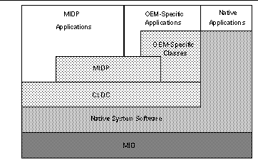

# MIDP 2.0 개요

# MIDP(Mobile Information Device Profile), v2.0 (JSR-118)

### JCP 공개 초안 사양

### Java 2 Platform, Micro EditionTM

---

##### *Copyright 2000,2002, Motorola, Inc. and Sun Microsystems, Inc. 모든 권리는 저작권자의 소유입니다.*

**본 문서 및 관련된 모든 문서는 사양 라이센스 조항의 적용을 받습니다.**

---

### 머리말

본 문서는 Java 2 Platform, Micro Edition(J2METM)용 *MIDP (Mobile Information Device Profile) v2.0 사양*을 정의합니다.

J2ME *프로필*은 특정 수직 시장이나 업계의 장치 유형별 API 집합을 정의합니다. 프로필에 대해서는 관련 발행물인 *Configurations and Profiles Architecture Specification*, Sun Microsystems, Inc.에서 보다 정확하게 정의합니다.

### 개정 기록

| 날짜 | 버전 | 설명 |
| --- | --- | --- |
| 2000년 9월 1일 | MIDP 1.0 사양 | 최종 MIDP 1.0 사양 |
| 2001년 10월 23일 | MIDP 2.0, EG 초안 2 | 전문가 그룹에게 발행된 최초의 완전한 초안 |
| 2001년 11월 6일 | MIDP 2.0, EG 초안 3 | 10월 30-31일에 개최된 전문가 그룹 회의에서 확정된 변경 사항 통합 |
| 2001년 11월 20일 | MIDP 2.0, EG 초안 4 | EG 메일링 목록에서 논의된 변경 사항 통합 |
| 2001년 12월 18일 | MIDP 2.0, EG 초안 5 | 12월 5-6일에 개최된 전문가 그룹 회의 및 EG 메일링 목록에서 확정된 변경 사항 통합. 커뮤니티 검토용으로 발행 |
| 2002년 2월 12일 | MIDP 2.0, EG 초안 6 | 커뮤니티 검토 및 내부 EG 메일링 목록에서 확정된 변경 사항 통합 |
| 2002년 3월 12일 | MIDP 2.0, EG 초안 7 | 2월 20-21일에 개최된 전문가 그룹 회의 및 EG 메일링 목록에서 확정된 변경 사항 통합. 공개 검토용으로 발행 |
| 2002년 4월 9일 | MIDP 2.0, EG 초안 8 | 3월 26일에 개최된 전문가 그룹 회의 및 EG 메일링 목록에서 확정된 변경 사항 통합 |
| 2002년 4월 23일 | MIDP 2.0, EG 초안 9 | EG 메일링 목록에서 논의된 변경 사항 통합 |
| 2002년 5월 9일 | MIDP 2.0, EG 초안 10 | EG 메일링 목록에서 논의된 변경 사항 통합 |
| 2002년 5월 29일 | MIDP 2.0, EG 초안 11 | EG 메일링 목록에서 논의된 변경 사항 통합 |
| 2002년 6월 11일 | MIDP 2.0, EG 초안 12 | EG 메일링 목록에서 논의된 변경 사항 통합. 이 초안은 모든 영역의 기능 면에서 최종본으로 간주됩니다. 필요한 경우 추가 설명과 편집 변경을 위해 하나 이상의 개정본을 발행할 수도 있습니다. |
| 2002년 7월 15일 | MIDP 2.0, EG 초안 13 | EG 메일링 목록에서 논의된 편집 변경 및 설명 통합. 최종 초안 후보 1입니다. |
| 2002년 8월 2일 | MIDP 2.0, EG 초안 14 | RI 및 TCK 팀과 EG의 편집 변경과 설명 통합. 이 초안은 제안된 최종 초안으로 PMO에 제출되었습니다. |
| 2002년 9월 4일 | MIDP 2.0, EG 초안 15 | RI 및 TCK 팀과 EG의 사소한 편집 변경 및 설명 통합 |
| 2002년 11월 5일 | MIDP 2.0, 최종 사양 | 보안 정책 부록에 사소한 변경 사항 통합, 잘못된 IETF URL과 MIDlet.platformRequest() 메소드 서명 수정, 저작권 공동 소유권 최종 확정, 최종 사용권 통합 |

### 본 사양의 사용자

본 문서는 다음 사용자를 주요 대상으로 합니다.

- 이 프로필을 정의하는 Java Community Process (JCP) 전문가 그룹
- MIDP 구현자
- MIDP를 대상으로 하는 응용 프로그램 개발자
- MIDP 장치를 지원하는 인프라를 배포하는 네트워크 운영자

### 본 사양의 구성 방법

본 사양은 HTML 파일과 다음 관련 문서에 포함되어 있습니다.

- JavaDoc API 설명서
- OTA User Initiated Provisioning 사양
- MIDlet Suite 보안
- GSM/UMTS 호환 장치에 권장되는 보안 정책

본 문서와 API 설명서에는 요구 사항이 명시되어 있습니다. 서로 충돌하는 항목이 있을 경우 본 문서에 명시된 요구 사항이 API 설명서보다 우선합니다.

### 관련 문서

- *The Java Language Specification, Second Edition* by James Gosling, Bill Joy, and Guy L. Steele. Addison-Wesley, June 2000, ISBN 0-201-31008-2
- *The Java Virtual Machine Specification (Java Series), Second Edition* by Tim Lindholm and Frank Yellin. Addison-Wesley, 1999, ISBN 0-201-43294-3
- Connected, Limited Device Configuration (JSR-30), Sun Microsystems, Inc.
- Mobile, Information Device Profile (JSR-37), Sun Microsystems, Inc.
- Connected, Limited Device Configuration 1.1 (JSR-139), Sun Microsystems, Inc.

### 보고 및 연락처

본 사양에 대한 사용자 의견에 항상 귀를 기울이고 있습니다. 의견이 있으면 다음 전자 우편 주소로 보내 주십시오.

*jsr-118-comments@jcp.org*

### 정의

본 문서에서 사용하는 정의는 RFC 2119에 규정된 정의를 기반으로 합니다.

  
**사양 용어**

| 용어 | 정의 |
| --- | --- |
| 해야 합니다 | 관련된 정의는 이 사양의 절대 요구 사항입니다. |
| 해서는 안 됩니다 | 이 사양의 절대 금지 사항입니다. |
| 하는 것이 좋습니다 | 권장되는 방법을 나타냅니다. 이 권장 사항을 무시해야 하는 상황과 이유가 있을 수도 있지만 다른 방식을 선택하기 전에 함축된 모든 의미를 이해하고 신중하게 판단해야 합니다. |
| 하지 않는 것이 좋습니다 | 권장되지 않는 방법을 나타냅니다. 특정 동작이 허용되거나 심지어 도움이 되는 상황과 이유가 있을 수도 있지만, 이 용어로 설명된 동작을 구현하려는 경우 먼저 함축된 모든 의미를 이해하고 신중하게 판단해야 합니다. |
| 할 수도 있습니다 | 전적으로 사용자 선택에 따라 결정되는 항목을 나타냅니다. |

### 공헌자

본 사양은 JSR-118 전문가 그룹에 의해 Java Community Process의 일부로 작성되었습니다. 아래에는 전문가 그룹에 속해 있는 회사와 개인이 알파벳 순서로 나열되어 있습니다.

- 회사:
  - 4thpass Inc
  - AGEA Corporation
  - Alcatel
  - Aplix Corporation
  - AromaSoft Corp
  - Baltimore Technologies
  - CELLon France
  - Distributed Systems Technology Centre
  - Elata PLC
  - Esmertec
  - Espial Group Inc
  - France Telecom / Orange
  - Fujitsu Limited
  - German Aerospace Center (DLR), Institute of Communications and Navigation
  - Hitachi Ltd./Digital Media Group
  - In Fusio
  - J-PhoneEast Co. Ltd
  - Logica Mobile Networks
  - Mitsubishi Electric Corp
  - Mobile Scope AG
  - Mobilitec
  - Motorola
  - NEC Corporation
  - Nextel Communications Inc
  - Nokia
  - NTT DoCoMo, Inc
  - Omnitel Pronto Italia S.p.A
  - One 2 One
  - Openwave Systems, Inc
  - Orange (UK)
  - Palm
  - Philips Consumer Communications
  - Philips Semiconductors
  - Research In Motion (RIM)
  - Samsung Electronics Co., Ltd
  - Sharp Labs
  - Siemens AG
  - Siemens ICM
  - Smart Fusion
  - Sony Ericsson Mobile Communications
  - Sun Microsystems, Inc
  - Symbian Ltd
  - Telefonica Moviles Espana
  - Vaultus, Inc
  - Veloxsoft, Inc
  - Vodafone Global Platform & Internet Services
  - Vodafone Group Services Limited
  - Vodafone Multimedia
  - Zucotto Wireless
- 개인:
  - Fabio Ciucci
  - Glen Cordrey
  - Jon Eaves
  - David Hook
  - Myank Jain
  - Neil Katin
  - Steve Ma
  - Ravi Reddy
  - Wai Kit Tony Fung

---

### 소개

Java Specification Request (JSR) 118의 결과로 만들어진 본 문서는 Java 2 Platform, Micro Edition(J2METM)용 MIDP (Mobile Information Device Profile) v2.0을 정의합니다. 본 사양은 MID (Mobile Information Device)용 개방형 타사 응용 프로그램 개발 환경을 지원하는 데 필요한 향상된 구조 및 관련 API를 정의하는 것을 목적으로 합니다.

MIDP 2.0 사양은 MIDP 1.0 사양을 기반으로 하며, 이전 버전인 MIDP 1.0과 호환되므로 MIDP 1.0용으로 작성된 MIDlet을 MIDP 2.0 환경에서도 실행할 수 있습니다.

MIDP는 *Connected, Limited Device Configuration (JSR-30)*, Sun Microsystems, Inc.에 설명된 Connected, Limited Device Configuration (CLDC)에서 작동하도록 설계되었습니다. MIDP 2.0 사양은 CLDC 1.0 기능만 가정하여 만들어졌지만 *CLDC 1.1 (JSR-139)* 및 최신 버전에서도 제대로 작동할 것입니다. 대부분의 MIDP 2.0 구현은 CLDC 1.1을 기반으로 할 것으로 예상됩니다.

### 범위

MID (Mobile Information Device)는 광범위한 잠재적 기능 집합을 포괄합니다. MIDP 1.0 (JSR-037) 및 MIDP 2.0 (JSR-118) 전문가 그룹은 이러한 기능을 직접 다루지 않고 지정된 API 집합을 제한하여 광범위한 이식성과 성공적 배포를 위해 반드시 필요한 기능 영역만 다루는 데 동의했습니다. 여기에는 다음과 같은 기능 영역이 포함됩니다.

- 응용 프로그램 전달 및 요금 청구
- 응용 프로그램 라이프사이클(즉, MIDP 응용 프로그램의 의미 체계와 제어 방법 정의)
- 응용 프로그램 서명 모델 및 권한 있는 도메인 보안 모델
- 종단 간 트랜잭션 보안(https)
- MIDlet 푸시 등록(서버 푸시 모델)
- 네트워킹
- 영구 저장소
- 사운드
- 타이머
- 사용자 인터페이스(UI)(디스플레이, 입력, 고유한 게임 요구 사항 포함)

위의 기능에 대해서는 관련 Javadoc에서 자세히 설명합니다.

같은 논리에 의해 일부 기능 영역은 MIDP의 범위에서 벗어난 것으로 간주되었습니다. 여기에는 다음과 같은 기능 영역이 포함됩니다.

- 시스템 수준 API: MIDP API에서는 시스템 프로그래밍이 아닌 응용 프로그램 프로그래머 지원을 강조합니다. 따라서 MID의 전원 관리나 음성 CODEC에 대한 시스템 인터페이스를 지정하는 낮은 수준 API는 본 사양의 범위에서 벗어납니다.
- 낮은 수준의 보안: MIDP는 CLDC에서 제공하는 보안 기능 외에 어떠한 추가적인 낮은 수준의 보안 기능도 규정하지 않습니다.

### 구조

이 절에서는 구현자와 개발자가 MIDP를 구현 및 개발할 때 부딪치게 되는 문제에 대해 설명합니다. 포괄적이지는 않지만 이 장의 내용은 MIDP 전문가 그룹(MIDPEG)의 논의 중에 제기되었던 가장 중요한 문제들을 반영합니다.

앞에서 설명한 것처럼 MIDP는 MID를 위한 개방형 타사 응용 프로그램 개발 환경을 만드는 것을 목적으로 합니다. 이상적이라면 본 사양은 MIDP 사양에서 정의된 기능만 다루면 됩니다. 하지만 실제로 MIDP 사양을 구현하는 대부분의 장치는, 최소한 초기에는 현재 시장에 출시되어 있는 장치가 될 것입니다. 높은 수준의 구조에서는 MIDP가 어떻게 장치에 적용되는지를 높은 수준에서 보여줍니다. 이 그림에 표시된 모든 요소가 MIDP 사양을 구현하는 장치에 반드시 포함되는 것은 아닙니다. 또한 모든 장치가 해당 소프트웨어를 이 그림에 설명된 것처럼 배치하지도 않습니다.

높은 수준의 구조에서 낮은 수준 블록(MID)은 MID 하드웨어를 나타냅니다. 이 하드웨어 위에는 원시 시스템 소프트웨어가 있습니다. 이 계층에는 장치에서 사용하는 운영 체제와 라이브러리가 포함됩니다.

다음 수준부터 시작하여 왼쪽에서 오른쪽으로 소프트웨어의 다음 계층인 CLDC가 있습니다. 이 블록은 CLDC 사양에서 정의된 가상 머신 및 관련 라이브러리를 나타냅니다. 높은 수준의 Java API를 구축할 수 있는 기본 Java 기능을 제공합니다.

###### 높은 수준의 구조 보기

API의 두 범주는 CLDC 위에 표시되어 있습니다.

- MIDP API: 본 사양에서 정의된 API 집합
- OEM별 API: MIDP 영역에 포함된 광범위한 장치를 감안할 때 모든 장치 요구 사항을 완벽하게 다룬다는 것은 불가능합니다. 지정된 장치에 고유한 특정 기능을 액세스하기 위한 이러한 클래스는 OEM이 제공할 수 있으며 이 응용 프로그램은 다른 MID로 이식할 수 없습니다.

이 그림에서 CLDC는 MIDP와 장치별 API의 기반으로 표시되어 있습니다. 그렇다고 해서 API가 원시 기능(즉, 선언된 원시 메소드)을 가질 수 없다는 것은 아닙니다. 오히려 이 그림에서는 MID의 모든 원시 메소드가 실제로 Java 수준의 API를 기본 원시 구현에 매핑하는 가상 머신의 일부라는 것을 보여 주려고 합니다.

위의 그림에서 맨 위에 있는 블록은 MID에서 사용 가능한 응용 프로그램 유형을 나타냅니다. 아래 표에는 각 응용 프로그램 유형에 대한 간략한 설명이 나와 있습니다.

   
**MID 응용 프로그램 유형**

| 응용 프로그램 유형 | 설명 |
| --- | --- |
| MIDP | MIDP 응용 프로그램, 즉 MIDlet은 MIDP 및 CLDC 사양에서 정의된 API만 사용합니다. 이 응용 프로그램 유형은 MIDP 사양에서 중심을 이루고 있으며, MID에서 가장 일반적인 응용 프로그램 유형이 될 것으로 예상됩니다. |
| OEM 고유 | OEM 고유 응용 프로그램은 MIDP 사양에 속하지 않는 클래스(즉, OEM 고유 클래스)를 사용합니다. 이러한 응용 프로그램은 다른 MID로 이식할 수 없습니다. |
| 원시 | 원시 응용 프로그램은 Java로 작성되지 않고 MID의 기존 원시 시스템 소프트웨어를 바탕으로 구축되는 프로그램입니다. |

OEM 고유 응용 프로그램이나 원시 응용 프로그램을 다루는 것은 본 사양의 범위에서 벗어납니다.

### 장치 요구 사항

이 장에 나열된 요구 사항은 *Connected, Limited Device Configuration (JSR-30 and JSR-139)*, Sun Microsystems, Inc.에 수록된 요구 사항에 대한 추가 사항입니다.

높은 수준의 MIDP 사양은 MID의 처리 능력, 메모리, 연결 및 디스플레이 크기가 제한되어 있다고 가정합니다.

#### 하드웨어

앞에서 설명한 것처럼 MIDP는 MID를 위한 개방형 타사 응용 프로그램 개발 환경을 만드는 것을 목적으로 합니다. 이 목적을 달성하기 위해 MIDPEG는 MID의 최소 요구 사항을 다음과 같이 정의했습니다.

- 디스플레이:

- 화면 크기: 96x54
- 디스플레이 깊이: 1비트
- 픽셀 모양(가로 세로비): 약 1:1

- 입력:

- 사용자 입력 기법(한손 키보드, 양손 키보드 또는 터치 스크린) 중 하나 이상

- 메모리:

- MIDP 구현에 256KB의 비휘발성 메모리(CLDC 요구 사항보다 큼)
- 응용 프로그램에서 작성된 영구 데이터에 8KB의 비휘발성 메모리
- Java 런타임(예: Java 힙)에 128KB의 휘발성 메모리

- 네트워킹:

- 제한된 대역폭을 사용한 단속적(가능한 경우) 양방향 무선

- 사운드:

- 전용 하드웨어나 소프트웨어 알고리즘을 통한 톤 재생 기능

MID의 예로는 휴대폰, 양방향 호출기, 무선 지원 PDA 등이 있습니다.

#### 소프트웨어

앞에서 설명한 하드웨어 특성을 갖춘 장치도 광범위한 시스템 소프트웨어 기능을 제공할 수 있습니다. 지배적인 대규모 시스템 소프트웨어 구조가 있는 소비자 데스크탑 컴퓨터 모델과 달리 MID 영역은 다양한 시스템 소프트웨어를 이용합니다. 예를 들어, 일부 MID는 다중 처리 및 계층 구조적 파일 시스템을 지원하는 완전한 기능의 운영 체제를 이용하지만 파일 시스템 없이 스레드 기반의 작은 운영 체제를 이용하는 MID도 있습니다. 이러한 다양성 때문에 MIDP는 MID의 시스템 소프트웨어에 대한 가정을 최소화합니다. 요구 사항은 다음과 같습니다.

- 기본 하드웨어를 관리하기 위한 최소 커널(즉, 인터럽트, 예외 및 최소 예약 처리). 이 커널은 Java Virtual Machine (JVM)을 실행할, 예약 가능한 엔티티를 최소 하나 이상 제공해야 합니다. 커널에서 별도의 주소 공간(또는 프로세스)을 지원하거나 실시간 예약 또는 대기 시간 동작에 대한 어떠한 보증을 할 필요는 없습니다.
- 영구 저장소에 대한 RMS (Record Management System) API의 요구 사항을 지원하기 위해 비휘발성 메모리에서 읽고 쓰는 기법
- 네트워킹 API를 지원하기 위한, 장치 무선 네트워킹에 대한 읽기 및 쓰기 액세스
- 영구 저장소에 기록된 레코드의 타임 스탬프에 사용할 기본 시간을 제공하고 타이머 API의 기반을 제공하는 기법
- 비트맵 그래픽 디스플레이로 쓰는 최소 기능
- 앞에서 설명한 세 가지 입력 기법 중 하나 이상으로부터 사용자 입력을 캡처하는 기법
- 장치의 응용 프로그램 라이프사이클을 관리하는 기법

### 사양 요구 사항

이 절에는 본 사양의 명시적 요구 사항이 나열되어 있습니다. 다른 요구 사항은 관련 Javadoc에서 찾을 수 있습니다. 여기에 나열된 요구 사항이 본 사양의 다른 부분에 나열된 요구 사항과 다를 경우 이 요구 사항이 우선하며 충돌하는 요구 사항을 대신합니다.

호환되는 MIDP 2.0 구현:

- MIDP 1.0 및 MIDP 2.0 MIDlet과 MIDlet Suite를 지원해야 합니다.
- 본 사양에 설명된 모든 패키지, 클래스 및 인터페이스를 포함해야 합니다.
- OTA User Initiated Provisioning 사양을 구현해야 합니다.
- 푸시를 위해 0개 이상의 지원 프로토콜을 통합할 수도 있습니다.
- 본 사양에 설명된 기법을 사용할 때의 네트워크 사용을 사용자에게 시각적으로 표시해야 합니다.
- CommConnection 인터페이스를 통해 장치에서 사용 가능한 직렬 포트를 액세스할 수 있도록 지원할 수도 있습니다.
- HTTP 1.1 서버 및 서비스를 직접 또는 WAP나 i-mode와 같은 게이트웨이 서비스를 사용하여 액세스할 수 있도록 지원해야 합니다.
- 보안 HTTP 연결을 직접 또는 WAP나 i-mode와 같은 게이트웨이 서비스를 사용하여 지원해야 합니다.
- 데이터그램 연결을 지원하는 것이 좋습니다.
- 서버 소켓 스트림 연결을 지원하는 것이 좋습니다.
- 소켓 스트림 연결을 지원하는 것이 좋습니다.
- 보안 소켓 스트림 연결을 지원하는 것이 좋습니다.
- PNG 이미지 투명성을 지원해야 합니다.
- 다른 이미지 형식을 추가로 지원할 수도 있습니다.
- 미디어 패키지에서 톤 생성을 지원해야 합니다.
- 샘플 사운드가 지원되는 경우 8비트의 8KHz 모노 선형 PCM wav 형식을 지원해야 합니다.
- 다른 샘플 사운드 형식을 추가로 지원할 수도 있습니다.
- 합성 사운드가 지원되는 경우 Scalable Polyphony MIDI(SP-MIDI) 및 SP-MIDI Device 5-to-24 Note Profile을 지원해야 합니다.
- 다른 MIDI 형식을 추가로 지원할 수도 있습니다.
- "신뢰할 수 없는 MIDlet Suite"를 지원하는 데 필요한 기법을 구현해야 합니다.
- 장치 보안 정책에서 신뢰할 수 없는 응용 프로그램을 허용하거나 지원하지 않는 경우 "신뢰할 수 있는 MIDlet Suite 보안"을 구현해야 합니다.
- 장치가 PKI를 사용하여 응용 프로그램을 서명하지 않는 경우 서명된 MIDlet Suite를 신뢰할 수 있는 것으로 인식하도록 "X.509 PKI를 사용한 신뢰할 수 있는 MIDlet Suite"를 구현해야 합니다.
- HTTPS 및 SecureConnections의 인증서 처리를 위한 "MIDP x.509 인증서 프로필"을 구현해야 합니다.
- javax.microedition.io의 패키지 설명서에 규정된 것처럼 미디어 API의 I/O 액세스에 일반 연결 프레임워크의 I/O 액세스와 동일한 보안 요구 사항을 시행해야 합니다.
- 응용 프로그램이 문자 인코딩을 정의할 수 있도록 하는 API에 대해 최소한 UTF-8 문자 인코딩을 지원해야 합니다.
- 다른 문자 인코딩을 지원할 수도 있습니다.
- 장치가 복사 방지 기법을 구현하지 않는 경우 어떠한 MIDle Suite의 복사본도 만들 수 없도록 하는 것이 좋습니다.

##### 참조 자료

1. Scalable Polyphony MIDI Specification Version 1.0, MIDI Manufacturers Association, Los Angeles, CA, USA, February 2002.
2. Scalable Polyphony MIDI Device 5-to-24 Note Profile for 3GPP Version 1.0, RP-35, MIDI Manufacturers Association, Los Angeles, CA, USA, February 2002.
